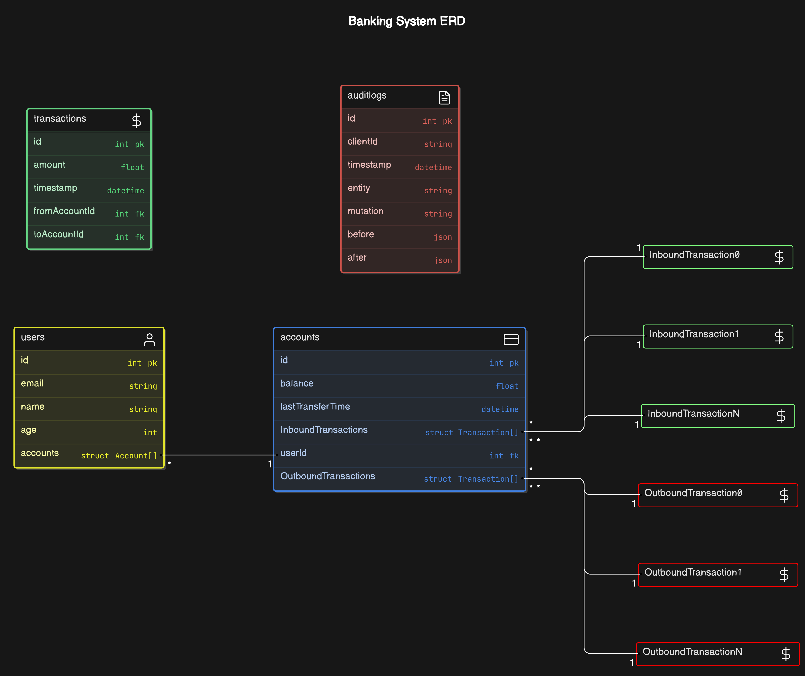

# API Documentation

## Overview
This documentation outlines the API endpoints, how audit logging works, and the overall design of the system. The system is designed to manage users, accounts, and transactions between accounts while maintaining audit logs for all changes.

Each auditlog has TTL of 10 miniutes, and using a Goroutine we implement a cleanup job that dumps those logs with a cutoff if they lived longer than 1 miniutes.


   

## Atomicity
While a single operation using **ent** may be atomic, we sometime execute multiple operations in succcession.
To make sure those operations are still happening "atomically", were using withTx function that utilizes **ent.Tx** transaction API, to execute transactional operations.

## NOTE 
**The /cmd/main_test/ isnt complete, and some of the deletion tests are currently inaccurate**
## Installation Instructions

### Prerequisites

- Ensure you have Docker and Docker Compose installed on your system.
- Ensure you have Bash installed

### Setup Script

The `setup.sh` script automates the setup process for the Audit System project. It performs the following tasks:

1. **Install and start a PostgreSQL container**:
   - Pulls the latest PostgreSQL image from Docker Hub.
   - Runs a PostgreSQL container with specified environment variables (e.g., user, password, and database name).

2. **Install Go**:
   - Downloads and installs Go 1.22.4.
   - Sets up the necessary environment variables for Go.

3. **Generate Ent schema and build the project**:
   - Generates Ent schema for database interaction.
   - Builds the Go project.

4. **Run the Audit System service**:
   - Starts the Audit System service

## Overall Design

- **Repositories**: Handle database interactions for each entity (User, Account, Transaction, AuditLog).
  - **UserRepository**: Manages user data with methods for creating, retrieving, and updating users.
  - **AccountRepository**: Manages account data with methods for creating, retrieving, and updating accounts.
  - **TransactionRepository**: Manages transaction data with methods for creating and retrieving transactions.
  - **AuditLogRepository**: Manages audit log data with methods for creating and retrieving audit logs.

- **Services**: Implement business logic for each entity, using the repositories.
  - **UserService**: Provides business logic for user operations.
  - **AccountService**: Provides business logic for account operations.
  - **TransactionService**: Provides business logic for transaction operations.
  - **AuditLogService**: Provides business logic for audit log operations.

- **Handlers**: Define the HTTP endpoints and handle HTTP requests, using the services.
  - **UserHandler**: Handles HTTP requests for user-related operations.
  - **AccountHandler**: Handles HTTP requests for account-related operations.
  - **TransactionHandler**: Handles HTTP requests for transaction-related operations.
  - **AuditLogHandler**: Handles HTTP requests for audit log-related operations.

- **Middleware**: Handle cross-cutting concerns like setting the `clientId` in the request context.
  - **ClientIDMiddleware**: Sets the `clientId` in the request context from the HTTP headers.

- **Hooks**: Capture and log changes to entities for audit purposes.
  - **AuditLogHook**: Captures mutations and logs them asynchronously to avoid blocking the main operation using **Goroutines**


# API Routes
  - `POST /users/`
  - `GET /users/`
  - `GET /users/:email`
  - `PUT /users/:email`
  - `GET /users/:email/accounts`
  - `POST /users/:email/accounts`
  - `GET /users/:email/accounts/:accountID`
  - `PUT /users/:email/accounts/:accountID`
  - `DELETE /users/:email/accounts/:accountID`
  - `POST /accounts/:email`
  - `GET /accounts/:email`
  - `GET /accounts/:email/:accountID`
  - `DELETE /accounts/:email/:accountID
  - `GET /accounts/:email/:accountID/transactions`
  - `GET /accounts/:email/:accountID/transactions/inbound`
  - `GET /accounts/:email/:accountID/transactions/outbound`
  - `POST /transactions/:email/:accountID`
  - `GET /transactions/:email/:accountID/inbound`
  - `GET /transactions/:email/:accountID/outbound`
  - `GET /transactions/:email/:accountID`
  - `GET /auditlogs/`
  - `GET /auditlogs/:email`

## Endpoints Documentation
### User Endpoints
- **Create User**
  - `POST /users/`
  - Description: Creates a new user.
  - Request Body:
    ```json
    {
      "email": "user@example.com",
      "name": "John Doe",
      "age": 30
    }
    ```

- **Get All Users**
  - `GET /users/`
  - Description: Retrieves all users.

- **Get User by Email**
  - `GET /users/:email`
  - Description: Retrieves a user by email.

- **Update User**
  - `PUT /users/:email`
  - Description: Updates a user by email.
  - Request Body:
    ```json
    {
      "name": "John Doe",
      "age": 31
    }
    ```

- **Get Accounts by User Email**
  - `GET /users/:email/accounts`
  - Description: Retrieves all accounts for a user by email.

- **Create Account for User**
  - `POST /users/:email/accounts`
  - Description: Creates a new account for a user by email.
  - Request Body:
    ```json
    {
      "balance": 1000.0
    }
    ```

- **Get Account by ID**
  - `GET /users/:email/accounts/:accountID`
  - Description: Retrieves an account by ID for a user by email.

- **Update Account by ID**
  - `PUT /users/:email/accounts/:accountID`
  - Description: Updates an account by ID for a user by email.
  - Request Body:
    ```json
    {
      "balance": 2000.0
    }
    ```

### Account Endpoints
- **Create Account**
  - `POST /accounts/:email`
  - Description: Creates a new account for a user by email.
  - Request Body:
    ```json
    {
      "balance": 1000.0
    }
    ```

- **Get Accounts by Email**
  - `GET /accounts/:email`
  - Description: Retrieves all accounts for a user by email.

- **Get Account by ID**
  - `GET /accounts/:email/:accountID`
  - Description: Retrieves an account by ID for a user by email.

- **Get Transactions for Account**
  - `GET /accounts/:email/:accountID/transactions`
  - Description: Retrieves all transactions for an account by ID.

- **Get Inbound Transactions for Account**
  - `GET /accounts/:email/:accountID/transactions/inbound`
  - Description: Retrieves inbound transactions for an account by ID.

- **Get Outbound Transactions for Account**
  - `GET /accounts/:email/:accountID/transactions/outbound`
  - Description: Retrieves outbound transactions for an account by ID.

### Transaction Endpoints
- **Create Transaction**
  - `POST /transactions/:email/:accountID`
  - Description: Creates a new transaction from an account by ID for a user by email.
  - Request Body:
    ```json
    {
      "toAccountID": 2,
      "amount": 100.0
    }
    ```

- **Get Transactions for Account**
  - `GET /transactions/:email/:accountID`
  - Description: Retrieves all transactions for an account by ID.

- **Get Inbound Transactions for Account**
  - `GET /transactions/:email/:accountID/inbound`
  - Description: Retrieves inbound transactions for an account by ID.

- **Get Outbound Transactions for Account**
  - `GET /transactions/:email/:accountID/outbound`
  - Description: Retrieves outbound transactions for an account by ID.

### Audit Log Endpoints
- **Get All Audit Logs**
  - `GET /auditlogs/`
  - Description: Retrieves all audit logs.

- **Get Audit Logs by Email**
  - `GET /auditlogs/:email`
  - Description: Retrieves audit logs by email.

## Audit Logging
The system includes an audit logging mechanism that logs all changes made to users, accounts, and transactions. The audit logs include the following details:
- `clientId`: The ID of the client making the request.
- `timestamp`: The time when the change occurred.
- `entity`: The type of entity that was changed (e.g., User, Account, Transaction).
- `mutation`: The type of mutation (e.g., Create, Update, Delete).
- `before`: The state of the entity before the change.
- `after`: The state of the entity after the change.

### How Audit Logging Works
- **Middleware**: The `ClientIDMiddleware` middleware sets the `clientId` in the request context.
- **Hook**: The `AuditLogHook` hook captures mutations and logs them. It executes the mutation first and then logs the change in a separate goroutine to avoid blocking the main operation.
- **Service**: The `AuditLogService` provides methods for creating and retrieving audit logs.
- **Repository**: The `AuditLogRepository` interacts with the database to store and retrieve audit logs.

### Example Audit Log Entry
```json
{
  "clientId": "client-123",
  "timestamp": "2024-06-17T10:00:00Z",
  "entity": "User",
  "mutation": "Update",
  "before": {
    "name": "John Doe",
    "age": 30
  },
  "after": {
    "name": "John Doe",
    "age": 31
  }
}
